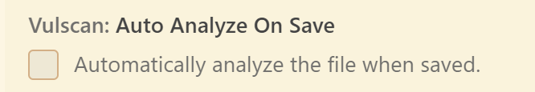
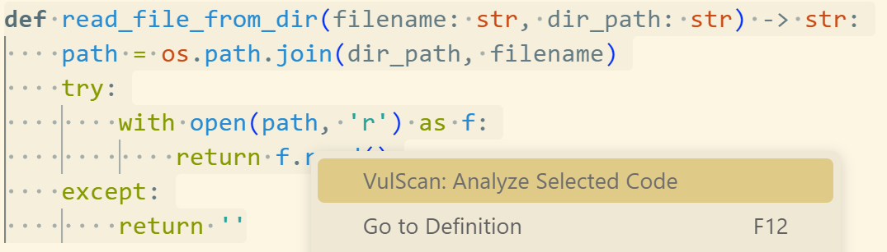

# VirtueGuard-Code README

This is the README for our extension "VirtueGuard-Code", a powerful vulnerability scanning tool for your code.

## 1. Configuration

### 1.1 API Base URL

You can set the API base URL by setting the `vulscan.apiBaseUrl` in the `settings.json` file. The default URL is "http://api.virtueai.io/api/vulscan".

### 1.2 Auto-Analysis Settings

You can enable or disable automatic analysis on file save by setting `vulscan.autoAnalyzeOnSave` to `true` or `false` in your settings.

## 2. How to use

We support two modes for vulnerability scanning:

### 2.1 Autoscan Mode

This mode automatically scans your code for vulnerabilities whenever you save a file. It's perfect for continuous security monitoring during development.

Features:
- Automatic analysis on file save
- Real-time vulnerability detection
- Visual indicators for vulnerable code sections
- Detailed vulnerability reports with CWE types
- Code improvement suggestions

To enable this mode:
1. Open VS Code settings
2. Search for "vulscan.autoAnalyzeOnSave"
3. Set it to `true`

### 2.2 Manual Scan Mode

This mode allows you to analyze specific code sections for vulnerabilities. It's ideal for targeted security reviews.

Features:
- Select any code section for analysis
- Deep dependency analysis
- Implementation context awareness
- Detailed vulnerability reports

To use this mode:
1. Select the code you want to analyze
2. Right-click and choose "VulScan: Analyze Selected Code" or use the command palette
3. View the analysis results and improvement suggestions

